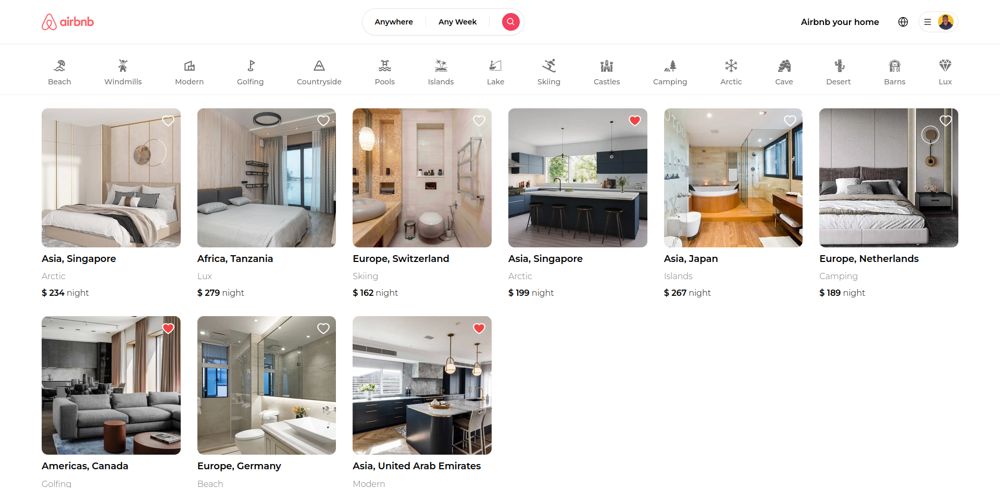

# Airbnb Clone | Minimalistic Short Term Rental Marketplace

Production Link URL: [Property Listing App](https://airbnb-clone-xi-nine.vercel.app/)

This is a lighweight version of Airbnb App. This clone covers the core fundamental features of Airbnb

## Status: Completed

I built an Airbnb clone using Next.js 15, Server Actions, MongoDB, TypeScript and TailwindCSS. The project will include features like user authentication, listing a property, delete a property, view the detail of a property, reserve a property and cancel a reservation. Next.js 15 and React 19 will power the front-end, while MongoDB will be the database, prisma to communicate with the database, server actions to make queries and api calls, with TypeScript ensuring code quality and TailwindCSS providing a modern and cohesive design and finally Auth.js for authentication.

## Technologies used

- Frontend: React 19, Next.js 15, TailwindCSS, TypeScript
- Backend: Next.js Server Actions, MongoDB, Prisma
- Authentication: NextAuth (Auth.js) with social login (Google and GitHub)
- Media Handling: Cloudinary for image uploads

## Features

- User authentication and registration
- Social login with Google and GitHub
- Creating, viewing, and deleting property listings
- Step-by-step property listing creation flow (category, location, images, description, price)
- Interactive map and country autocomplete
- Property reservation and cancellation
- Trip and reservation management dashboards
- Ability to favorite listings
- Filter modal with advanced querying
- Responsive UI with reusable components

This project demonstrates full CRUD capabilities, server-side rendering, and modern UX practices using the latest web technologies.

### PS: This is not made by AI, but by humans: Me, Myself and I
